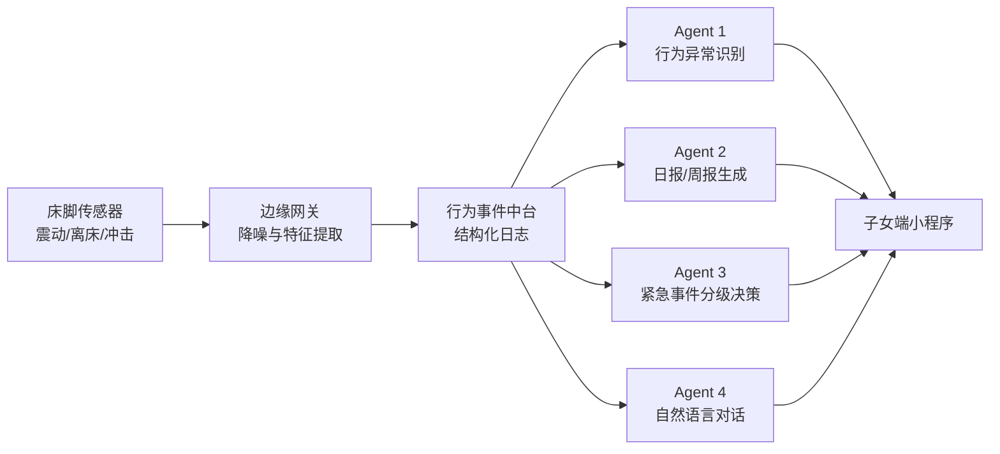
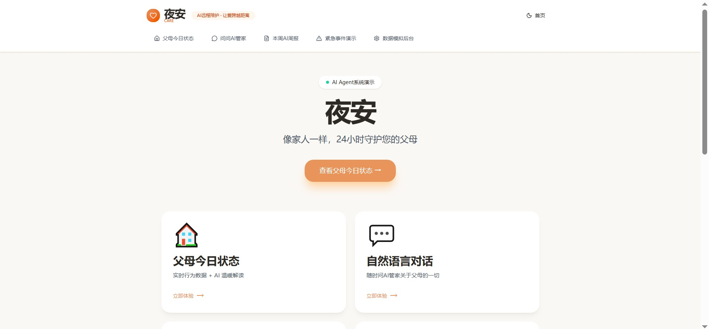
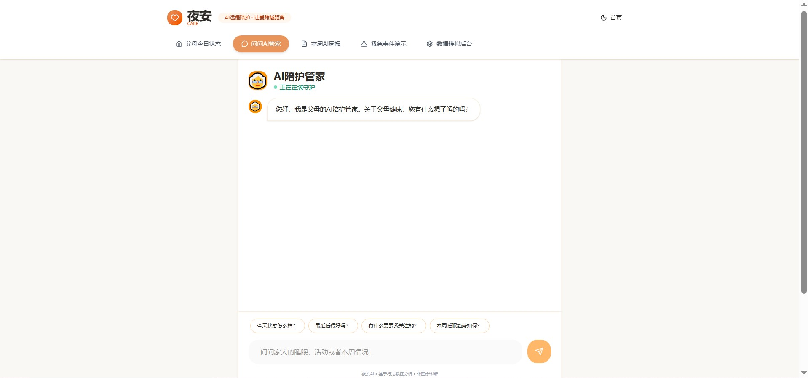
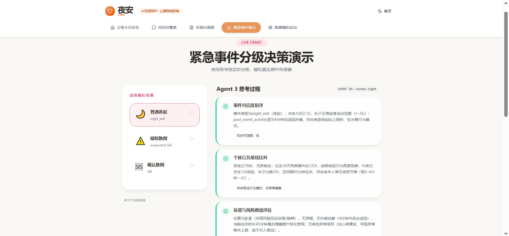
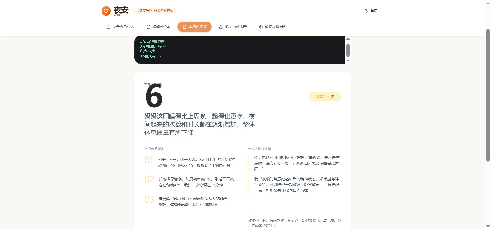

# 夜安 ｜AI 远程陪护 Agent

> 用无感硬件捕捉独居父母的日常行为变化，用大模型 Agent 帮异地子女判断：**"父母健康今天是否正常？"**
> **项目性质**：个人学习与项目展示用途，非商用。  
> **核心逻辑**：基于硬件感知（床脚传感器）+ 边缘计算 + 大模型 Agent 推理的多层架构，解决异地子女对独居老人"报喜不报忧"的信息焦虑。项目核心不是单一硬件报警器，而是一个 **"低成本感知入口 + 大模型远程陪护 Agent"** 的完整 AI 软硬件结合方案。

---

## 1. 项目一句话

**夜安 Care 是一个面向异地子女的 AI 远程陪护 Agent。**

它通过床脚传感器等无感硬件采集独居老人夜间行为事件，例如：

- 上床 / 起床时间；
- 夜间离床次数；
- 每次离床时长；
- 疑似异常冲击；
- 是否长时间未回床。

硬件不直接做"健康诊断"，而是把原始信号转成结构化行为数据，再由大模型 Agent 完成：

- 行为异常识别；
- 每日/每周状态总结；
- 紧急事件分级决策；
- 子女自然语言问询。

---

## 2. 为什么做这个？

### 目标用户

- **付费用户**：28-45 岁异地工作的子女；
- **被照护对象**：70 岁以上、独居或半独居父母。

### 核心痛点

异地子女最大的焦虑不是"父母一定会出事"，而是：

> **父母每天到底正不正常，我完全不知道。**

现实中常见情况是：

- 电话里父母总说"挺好的"；
- 摄像头会被老人认为是监视；
- 手环/手表需要佩戴和充电，老人容易抗拒或遗忘；
- 家庭陪伴机器人价格高、占空间，且依赖老人主动交互；
- 真正发生异常时，子女往往最后才知道。

因此，本项目希望解决的是：

> **如何在不打扰老人、不侵犯隐私的前提下，让异地子女获得最低限度但关键的"父母状态可见性"。**

---

## 3. 我们的解决方案

### 产品定位

夜安 Care 不是"床脚跌倒报警器"，而是：

> **AI 远程陪护 Agent + 低成本无感硬件入口。**

首发硬件模块选择床脚传感器，是因为夜间离床、床旁跌倒、长时间未回床，是独居老人居家风险中较高频、且适合低成本感知的场景。

### MVP 原型


### 系统架构



**AI Agent 不是说"你可能跌倒"，而是像一个住在隔壁的细心邻居，用数据来转述父母的状态：**
- 昨晚几点睡、期中起来几次；
- 本周睡得最晚的一天和平时有什么不同；
- 今天比过去 30 天是不是更累一点；
- 是否需要子女"今天打个电话问问"。

---

## 4. 项目演示与文档结构

### 📂 项目整体结构

| 目录 / 文件 | 说明 |
|---|---|
| [`app/nextjs-ai-care-system/`](./app/nextjs-ai-care-system/) | 🎯 **Demo 源代码** — 基于 React + Vite 的 4 Agent 交互演示 |
| [`docs/`](./docs/) | 📚 **项目全流程文档**（6 篇）：机会判断 / 用户验证 / MVP设计 / Agent工作流 / 商业逻辑 / 验证计划 |
| [`assets/`](./assets/) | 📸 **设计资产与截图**：Demo 截图 / Figma 原型 / 调研证据 |
| [`lib/`](./lib/) | 🧩 **核心公用模块**：DashScope API 封装 / System Prompts / Mock 数据 |

### 📄 核心文档索引

| 编号 | 文档 | 回答什么问题 |
|---|---|---|
| 01 | [`docs/01-opportunity.md`](./docs/01-opportunity.md) | 为什么做"夜安"？机会在哪？ |
| 02 | [`docs/02-user-evidence.md`](./docs/02-user-evidence.md) | 用户痛点真实存在吗？（小红书/知乎验证） |
| 03 | [`docs/03-mvp-design.md`](./docs/03-mvp-design.md) | MVP 具体长什么样？为什么选这些功能？ |
| 04 | [`docs/04-agent-workflow.md`](./docs/04-agent-workflow.md) | 4 个 AI Agent 怎么协同工作？（含 Prompt 与输出示例） |
| 05 | [`docs/05-business-model.md`](./docs/05-business-model.md) | 谁付钱？怎么定价？怎么和度小满业务协同？ |
| 06 | [`docs/06-validation-plan.md`](./docs/06-validation-plan.md) | 如果只有 2 周，怎么最低成本验证这个方向？ |

### 🧩 核心代码索引

| 模块 | 文件 | 说明 |
|---|---|---|
| DashScope 封装 | [`lib/dashscope.ts`](./lib/dashscope.ts) | 大模型 API 调用（流式 + 非流式） |
| Agent 1 Prompt | [`lib/prompts/anomaly.ts`](./lib/prompts/anomaly.ts) | 行为异常检测 Agent |
| Agent 2 Prompt | [`lib/prompts/report.ts`](./lib/prompts/report.ts) | 周报生成 Agent |
| Agent 3 Prompt | [`lib/prompts/emergency.ts`](./lib/prompts/emergency.ts) | 紧急事件分级决策 Agent |
| Agent 4 Prompt | [`lib/prompts/chat.ts`](./lib/prompts/chat.ts) | 陪护对话 Agent |
| Mock 数据 | [`lib/mock-data/`](./lib/mock-data/) | 模拟传感器数据（基线 / 今日 / 周 / 紧急事件） |

### 🎨 设计资产索引

| 资产 | 路径 | 说明 |
|---|---|---|
| Demo 运行截图 | [`assets/01.screenshots/`](./assets/01.screenshots/) | Chat/Dashboard/Emergency/Report 页面截图 |
| Figma MVP 原型 | [`assets/02.prototype/`](./assets/02.prototype/) | 硬件端与 App 端交互原型 |
| 用户调研证据 | [`assets/03.evidence_data/`](./assets/03.evidence_data/) | 小红书/知乎验证原始数据 |

---

## 5. Demo 快速启动

```bash
cd app/nextjs-ai-care-system
npm install
cp .env.local.example .env.local
# 在 .env.local 中填入 DASHSCOPE_API_KEY（从阿里云百炼平台获取）
npm run dev
```

Demo 使用 **Vite 开发服务器**（模拟 Next.js 结构），4 个 Agent 通过 DashScope API 直接调用通义千问。

---

## 6. Demo 系统展示

### Agent 1 — 行为异常检测（Dashboard）



### Agent 4 — 陪护对话（Chat）



### Agent 3 — 紧急事件分级决策（Emergency）



### Agent 2 — 周报生成（Report）



### 4 个 AI Agent 职责速览

| Agent | 职责 | 演示页面 | 核心能力 |
|---|---|---|---|
| 行为异常检测 | 对比 30 天基线识别异常 | Dashboard | 偏离度量化 + 温暖总结 |
| 周报生成 | 7 天数据 → 温暖周报 | Report | 数据叙事 + 可执行建议 |
| 紧急分级决策 | CoT 推理 → 4 级响应 | Emergency | 流式思考链 + 分级决策 |
| 陪护对话 | 自然语言问询 | Chat | 多轮对话 + 上下文记忆 |

---

## 7. 技术栈

| 层 | 选型 |
|---|---|
| 大模型 | 通义千问 qwen-plus / qwen-max（DashScope OpenAI 兼容接口） |
| 前端 Demo | React 19 + Vite 7 + TypeScript + Tailwind CSS 4 |
| 流式输出 | Server-Sent Events (SSE) |
| 图表 | Recharts |
| 动画 | Framer Motion + Lucide Icons |
| Agent 编排 | 原生调用，逻辑透明可控 |

---

## 8. 核心工作

1. **"我在做什么"**：我做一个面向异地子女的小硬件（床脚传感器）+ AI Agent 系统，每天自动告诉子女父母状态正不正常，不打扰老人，不让老人觉得被监视。
2. **"为什么值得做"**：独居老人居家风险是刚需，现有方案（摄像头、手环、机器人）都有明显缺陷。用低成本无感硬件做"状态感知入口"，用大模型 Agent 做"理解与沟通"，这个组合是一个新的解法。

---

> ⚠️ **版权声明**：本项目为个人学习与项目展示用途，保留所有权利。未经作者明确许可，禁止转载、商用或以任何形式二次发布。

*Made with ❤️ for caring families. 夜安 - 让爱不孤单。*
