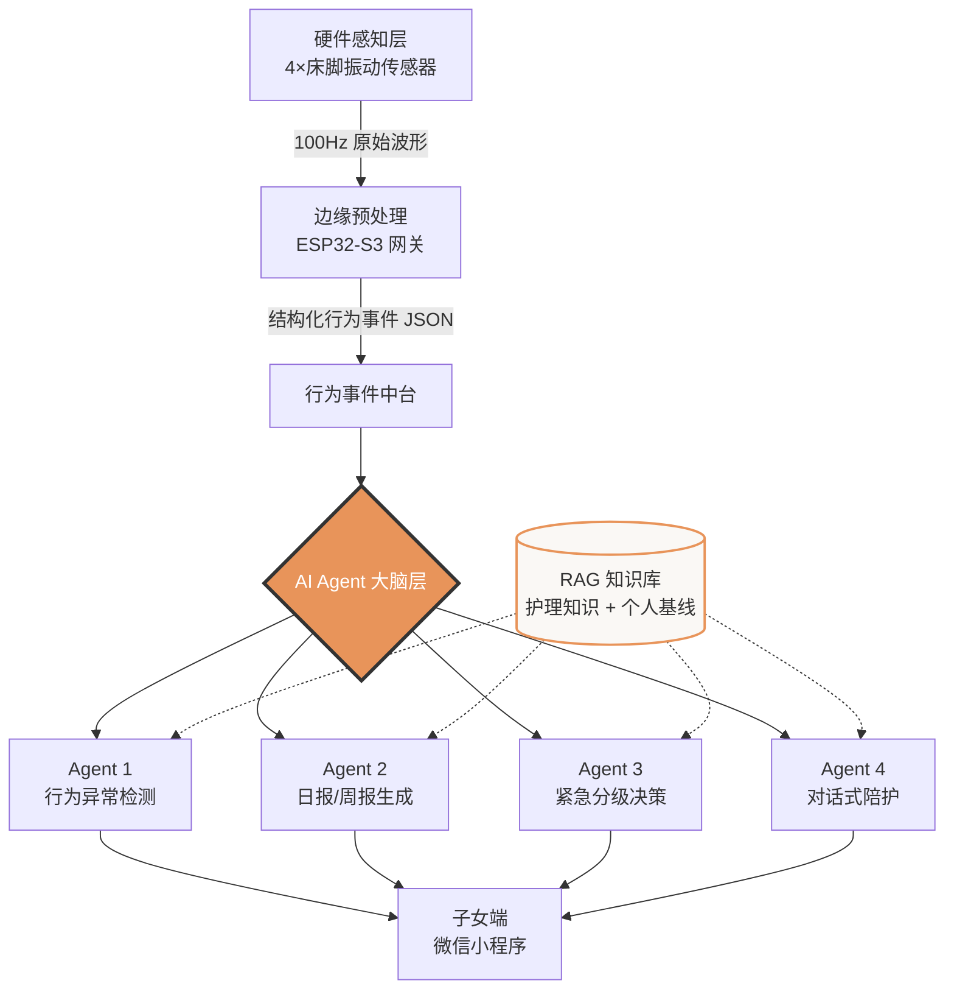
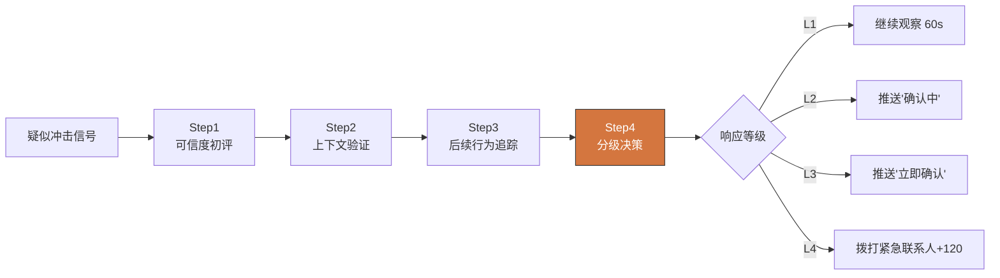
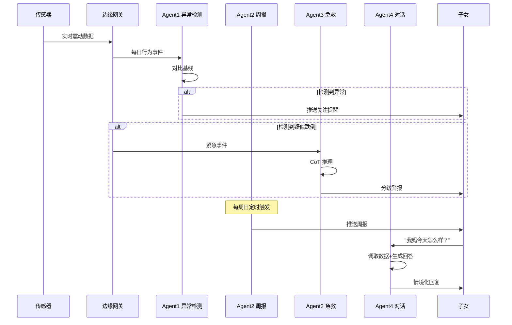

# AI Agent 工作流设计

> 本文档详细阐述「夜安」系统的核心 —— 4 个大模型 Agent 的协同工作机制。
> **核心理念**：硬件只负责"感知"，大模型 Agent 负责"理解、判断与沟通"。

---

## 一、整体架构：从震动信号到人话

### 1.1 数据流向全景图



### 1.2 为什么是"多 Agent"而非"单一大模型"？

| 设计原则 | 说明 |
|---------|------|
| **职责分离** | 异常检测要"严谨"、对话要"温暖"、急救要"果断"，不同任务需要不同的 Prompt 人格和温度参数 |
| **可解释性** | 每个 Agent 独立输出，便于追溯"为什么报警""为什么没报警" |
| **成本优化** | 高频低复杂度任务（如日报）用 qwen-plus，紧急决策用 qwen-max，按需调度 |
| **可扩展性** | 未来接入新数据源（门锁、水表）只需扩展对应 Agent，不影响其他模块 |

---

## 二、硬件如何变成"可被 AI 理解的语言"

### 2.1 关键设计：边缘预处理（不传原始数据）

传感器采集的是 100Hz 的三轴加速度波形，**直接喂给大模型既昂贵又无意义**。
我们在边缘端（网关）完成"信号 → 事件"的转化：

```
原始波形（不上云，保护隐私）
        ↓ 边缘端特征提取
结构化行为事件（仅上传这个）
```

### 2.2 结构化行为事件示例

```json
{
  "elder_id": "zhang_001",
  "date": "2025-06-18",
  "events": [
    { "type": "sleep_onset", "time": "23:50" },
    { "type": "night_exit", "time": "01:20", "duration_min": 8 },
    { "type": "night_exit", "time": "03:45", "duration_min": 12 },
    { "type": "night_exit", "time": "05:10", "duration_min": 9 },
    { "type": "wake_up", "time": "08:10" }
  ],
  "metrics": {
    "night_exit_count": 3,
    "max_exit_duration_min": 12,
    "gait_regularity": 0.62,
    "abnormal_impact": false
  }
}
```

**这一步是整个系统的关键**：把"机器才懂的波形"变成"大模型能推理的语义事件"。

---

## 三、四大 Agent 详细设计

### 🔍 Agent 1：行为异常检测 Agent

**职责**：对比个人历史基线，识别今日行为偏离，输出异常评分。

**核心技术点**：
- **个性化基线**：不用全局固定阈值（每个老人"正常"不同），而是学习该用户过去 30 天的行为模式
- **偏离度量化**：用标准差衡量异常程度，避免"一刀切"

**System Prompt 核心片段**：

```
你是行为异常检测 Agent。基于"30天基线"对比"今日数据"，
输出结构化异常分析。

【铁律】
1. 只描述行为事实，绝不做医学诊断
2. 异常评分必须有数据依据（偏离基线 N 个标准差）
3. 语气温暖克制，称呼"妈妈"而非"用户"

【输出格式：严格 JSON】
{
  "is_abnormal": boolean,
  "abnormal_score": 0-100,
  "abnormal_points": [...],
  "natural_language_summary": "...",
  "recommended_action": "继续观察|建议关注|建议联系"
}
```

**真实输入输出示例**：

输入：
```json
{
  "baseline": { "avg_night_exits": 1.2, "avg_exit_duration_min": 3 },
  "today": { "night_exits": 4, "max_exit_duration_min": 16 }
}
```

输出：
```json
{
  "is_abnormal": true,
  "abnormal_score": 68,
  "abnormal_points": [
    { "metric": "夜间起床次数", "baseline": "1.2次", "today": "4次", "deviation": "+233%" },
    { "metric": "最长离床时长", "baseline": "3分钟", "today": "16分钟", "deviation": "+433%" }
  ],
  "natural_language_summary": "妈妈昨晚起夜比平时明显增多，且有一次离床较久（16分钟）。整体作息有些紊乱，但目前没有发现紧急状况。",
  "recommended_action": "建议关注",
  "confidence": 85
}
```

---

### 📊 Agent 2：日报/周报生成 Agent

**职责**：把 7 天冰冷数据，翻译成异地子女能看懂、有温度的周报。

**核心技术点**：
- **数据 → 叙事的转化**：这是大模型不可替代的核心能力
- **RAG 增强**：检索老年护理知识库，让建议有依据
- **情绪管理**：既不淡化（漏掉风险），也不夸大（制造焦虑）

**System Prompt 核心片段**：

```
你是健康周报生成 Agent。把过去 7 天的数据，
翻译成一份"妈妈本周状态周报"。

【输出结构】
1. 整体评分（1-10）+ 较上周变化
2. 3 个关键发现（口语化，避免术语）
3. 2 条可执行建议（如"电话时可以问问..."）
4. 风险等级（绿/黄/红）
5. 一句温暖结语

【语气】像一个细心的家人在转述观察，不是冷冰冰的报告。
```

**真实输出示例**：

```json
{
  "overall_score": 7,
  "score_change": "-1",
  "summary_sentence": "妈妈本周整体作息正常，但夜间起床有所增多，值得关注。",
  "key_findings": [
    "夜间起床次数从上周平均 1.2 次增加到本周 2.8 次",
    "入睡时间逐日推迟，从 22:30 推迟到接近 23:30",
    "周三早上有一次离床时长达 12 分钟，比平时长很多"
  ],
  "actionable_suggestions": [
    "今晚电话时可以自然地问问：'最近晚上是不是老起夜呀？'",
    "如果起夜持续超过两周，建议带她做一次常规体检"
  ],
  "risk_level": "yellow",
  "warm_closing": "妈妈整体还好，您不用太担心，只是这些小变化值得多一份留意。"
}
```

---

### 🚨 Agent 3：紧急事件分级决策 Agent（核心亮点）

**职责**：疑似跌倒发生时，通过思考链（CoT）多步推理，做出分级响应。

**为什么这是整个系统的技术亮点**：
- **不是 if-else 报警**：传统设备一检测到冲击就狂响，误报率极高
- **像真人一样思考**：先评估 → 再验证 → 追踪 → 决策，4 步推理
- **分级响应**：避免误报骚扰，也避免漏报致命

**CoT 推理流程**：



**真实 CoT 推理示例**（这段建议在答辩时重点展示）：

```json
{
  "thinking_steps": [
    {
      "step": 1,
      "title": "事件可信度初评",
      "reasoning": "冲击力 8.2G，明显高于正常起床（2-3G）和翻身（约1G）。这是一个需要严肃对待的信号。",
      "conclusion": "初步可信度：高"
    },
    {
      "step": 2,
      "title": "上下文交叉验证",
      "reasoning": "时间为凌晨 2:34，符合夜间起夜场景。该用户过去 30 天无类似事件，不像习惯性误报模式。",
      "conclusion": "排除习惯性误判"
    },
    {
      "step": 3,
      "title": "后续行为追踪",
      "reasoning": "冲击发生后 30 秒内无任何活动信号——无翻身、无走动、无回床。这是高度危险信号。",
      "conclusion": "疑似失能或失去意识"
    },
    {
      "step": 4,
      "title": "分级响应决策",
      "reasoning": "综合三个判断：冲击强度高 + 时间上下文匹配 + 后续无活动。决定启动 Level 3 响应，并持续监测。",
      "conclusion": "Level 3 - 建议子女立即电话确认"
    }
  ],
  "final_decision": {
    "confidence": 88,
    "response_level": 3,
    "level_name": "确认警报",
    "actions": [
      "立即推送子女 APP 高优先级警报",
      "发送语音通话提醒至子女手机",
      "继续监测 2 分钟，若仍无活动则升级至 Level 4"
    ],
    "natural_language_alert": "妈妈卧室凌晨检测到疑似跌倒，且之后 30 秒无活动迹象，建议您立即拨打电话确认。"
  }
}
```

---

### 💬 Agent 4：对话式陪护 Agent

**职责**：子女用自然语言随时询问父母状况，Agent 基于真实数据回答。

**核心技术点**：
- **上下文记忆**：多轮对话，理解指代（"她""那时候"）
- **数据具体化**：不说"次数较多"，说"昨晚起来 3 次，分别在 1:20、3:45、5:10"
- **主动建议**：不只回答，还给可执行动作

**真实多轮对话示例**：

```
👦 子女：我妈今天怎么样？

🤖 Agent：妈妈今天整体还不错。昨晚 23:40 入睡，今早 8:10 起床，
   睡眠时间挺充足。不过夜里起了 3 次，比她平时 1 次稍微多一些。
   白天的活动信号正常，您不用太担心。

👦 子女：那她起夜那几次，有什么不对劲吗？

🤖 Agent：我看了一下，三次起夜分别在 1:20、3:45 和 5:10。
   第二次离床时间最长，大约 12 分钟，比平时久一点。
   这可能只是上厕所慢了点，但如果连续几天都这样，
   建议您今天电话时随口问问她最近睡得怎么样。

👦 子女：好，那我晚上给她打电话。

🤖 Agent：好的 👍 您可以自然地聊起来，不用让她觉得"被监视"了。
   比如就说"妈，最近天热，你晚上睡得还好吧？"，
   既关心又不会让她有压力。需要我之后继续帮您留意吗？
```

**边界处理示例**（体现专业性）：

```
👦 子女：你看我妈是不是有什么病？

🤖 Agent：我能看到的只是行为数据，没法判断具体的健康问题，
   这个需要专业医生来诊断。但我可以告诉您这周的行为变化：
   她的起夜次数在增多。如果您不放心，建议带她去医院
   做个常规检查会更安心。
```

---

## 四、Agent 协同的完整生命周期



---

## 五、技术选型说明

| 组件 | 选型 | 理由 |
|------|------|------|
| 大模型 | 通义千问 qwen-plus / qwen-max | 中文理解强、成本低、国内访问稳定 |
| 调用方式 | DashScope OpenAI 兼容接口 | 标准化、易切换 |
| 流式输出 | Server-Sent Events (SSE) | Agent 3/4 实时展示思考过程 |
| 知识增强 | RAG（向量检索） | 让护理建议有循证依据 |
| Agent 编排 | 原生调用（不用 LangChain） | 透明、可控、便于讲解 |

---

## 六、成本估算

| Agent | 调用频率 | 模型 | 单次成本 | 月成本/用户 |
|-------|---------|------|---------|------------|
| Agent 1 | 1次/天 | qwen-plus | ~0.004元 | ~0.12元 |
| Agent 2 | 1次/周 | qwen-plus | ~0.01元 | ~0.04元 |
| Agent 3 | 按需触发 | qwen-max | ~0.02元 | ~0.1元 |
| Agent 4 | 按需对话 | qwen-plus | ~0.005元 | ~0.3元 |
| **合计** | | | | **<0.6元/月** |

**结论**：单用户月 AI 成本不到 0.6 元，而服务订阅费 29 元/月，**毛利空间充足**。

