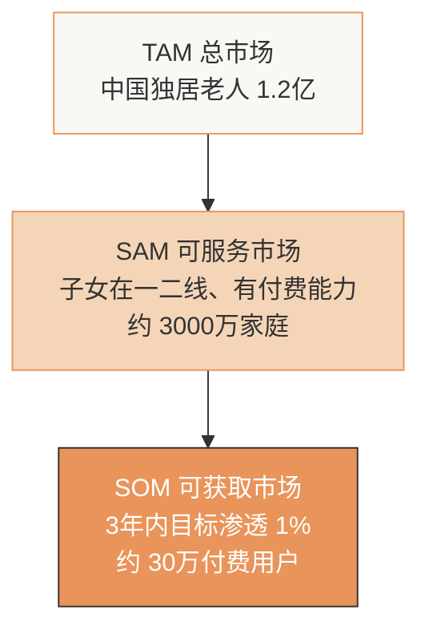

# 💰 商业判断

> 本文档阐述「夜安」的商业逻辑：谁付费、为什么付费、如何定价、如何获客、以及与度小满业务的协同。

---

## 一、核心商业逻辑：卖"安心"，不卖"硬件"

### 1.1 一句话商业模式

> **硬件接近成本价获客，AI 陪护服务订阅持续变现。**

我们不靠卖盒子赚钱，硬件只是 Agent 进入家庭的"入口"。
真正的价值是 Agent 提供的**持续陪护服务**——这也是护城河所在：用得越久，Agent 越懂这位老人。

### 1.2 商业模式画布（精简版）

| 维度 | 内容 |
|------|------|
| **价值主张** | 让异地子女随时知道"父母今天是否正常"，缓解信息焦虑 |
| **目标客户** | 一二线城市、月入 15k+、父母异地独居的子女 |
| **收入来源** | ① 硬件一次性收入（微利）② AI 服务订阅（核心） |
| **核心资源** | 多 Agent 系统 + 个性化行为基线数据 |
| **关键活动** | Agent 调优、内容营销、用户行为数据积累 |
| **成本结构** | 硬件 BOM + 大模型 API + 获客成本 |

---

## 二、付费用户：谁会掏钱？

### 2.1 付费决策者 ≠ 使用者

这是养老产品的关键洞察：

```
使用者（老人）→ 不付费、甚至抗拒
        ↓
付费者（子女）→ 因"内疚感"和"焦虑"主动付费
```

### 2.2 目标付费用户画像

| 标签 | 描述 |
|------|------|
| 年龄 | 28-45 岁 |
| 城市 | 一二线城市 |
| 收入 | 月入 15k+ |
| 家庭 | 父母 70+，独居在老家 |
| 心理 | 信息焦虑、内疚补偿、愿为"安心"付费 |
| 消费观 | 已经在给父母买保健品/体检，对几十元月费不敏感 |

### 2.3 为什么愿意付费？—— 内疚感经济

> 这是一个"为未知风险买单"的刚需消费。

子女的核心痛点不是"父母没人管"，而是**"我不知道，也无法及时知道"**。
我们卖的是**确定性**——每天打开 App 就能确认"妈妈还好好的"。

对比现有支出：
- 给父母买保健品：300-1000 元/月
- 一次理疗/按摩：200 元/次
- **我们的服务：29 元/月** —— 性价比极高的"安心保险"

---

## 三、定价策略

### 3.1 定价方案

| 项目 | 价格 | 说明 |
|------|------|------|
| **硬件套装** | 199 元/套 | 4 传感器 + 1 网关，BOM 约 85 元，微利获客 |
| **基础服务** | 免费 | 跌倒报警 + 每日简报（保证安全底线，人人可用） |
| **AI 会员（核心）** | 29 元/月 或 299 元/年 | 深度周报 + 无限对话 + 多源数据接入 |

### 3.2 定价逻辑

1. **硬件 199 元**：处于"无需家庭会议即可决策"的冲动消费区间
2. **基础免费**：降低尝试门槛，让"跌倒报警"这个核心安全功能人人可享
3. **会员 29 元/月**：对标一杯奶茶/一次打车，远低于保健品支出

### 3.3 单位经济模型（UE）

```
单用户首年收入 = 199（硬件）+ 29×12（会员）= 547 元
单用户首年成本 = 85（BOM）+ 0.6×12（AI）+ 25（获客摊销）≈ 117 元
单用户首年毛利 ≈ 430 元
毛利率 ≈ 78%
```

---

## 四、获客策略

### 4.1 获客渠道矩阵

| 渠道 | 策略 | 预估 CAC |
|------|------|---------|
| **小红书内容营销** | "内疚感"情感共鸣笔记，如"给爸妈装了它，我终于能睡着了" | ~25 元 |
| **抖音真实故事** | 拍摄独居老人子女的真实焦虑短剧 | ~30 元 |
| **养老社群合作** | 老年大学、社区养老中心异业合作 | ~20 元 |
| **药店/体检中心** | 体检后向有独居父母的客户推荐 | ~35 元 |
| **老客裂变** | 推荐好友各得 1 个月会员 | ~10 元 |

### 4.2 内容营销核心打法

**情感共鸣 > 功能罗列**

❌ 不要说："本产品采用 MEMS 传感器，支持跌倒检测"
✅ 要说："我妈昨晚起夜 3 次，但她电话里只说'好着呢'。还好有它，我才知道该多问一句。"

---

## 五、市场规模估算（TAM-SAM-SOM）



**SOM 收入测算**：
```
30 万用户 × 547 元/年 ≈ 1.64 亿元/年
```

---

## 六、与度小满业务的战略协同（核心加分项）

> 这不仅是一个硬件项目，更是一个**"适老化数据入口"**。

### 6.1 数据资产价值

「夜安Care」持续积累的老人**行为健康数据**（作息规律性、活动能力趋势、夜间异常频率），构成了一个独特的**适老化风控数据维度**。

### 6.2 三个金融协同场景

| 场景 | 协同方式 |
|------|---------|
| **长护险定价** | 为生活规律、健康指标稳定的老人提供更优惠的长期护理险保费，实现"数据驱动的差异化定价" |
| **养老金融获客** | 通过子女这一高净值、高责任感群体，触达养老理财、养老储蓄等产品 |
| **健康险风控** | 行为基线数据可作为健康险的辅助风控变量，降低逆向选择风险 |

### 6.3 与度小满的契合点

- **普惠属性**：低价硬件 + 普惠服务，契合度小满"普惠金融"定位
- **数据驱动**：用大模型让数据产生决策价值，契合度小满技术基因
- **银发蓝海**：切入万亿级银发经济，为金融业务开辟新客群入口

---

## 七、风险与应对

| 风险 | 应对策略 |
|------|---------|
| 大厂竞争（华为等） | 差异化定位：不绑定全屋生态、极致低价、Agent 的"温度"体验 |
| 续费率不足 | 持续提升 Agent 价值（多源数据、健康趋势），增强黏性 |
| 数据隐私合规 | 边缘计算 + 仅上传结构化事件 + 明确授权机制 |
| 硬件信号不稳定 | 多点传感器融合 + 持续算法优化 |