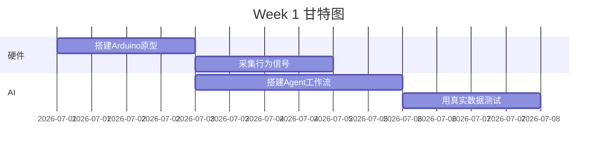
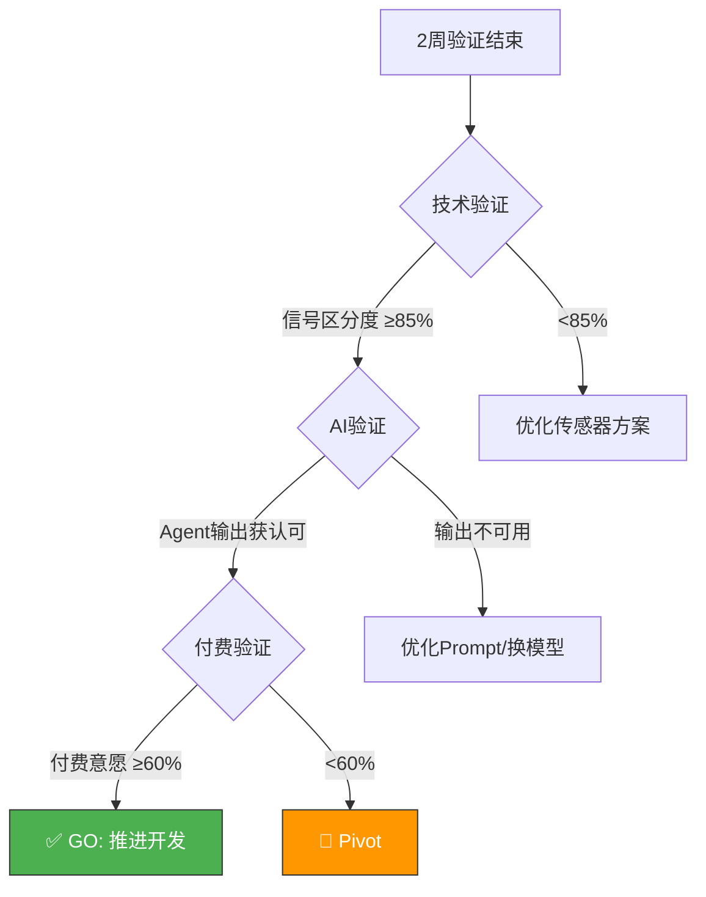
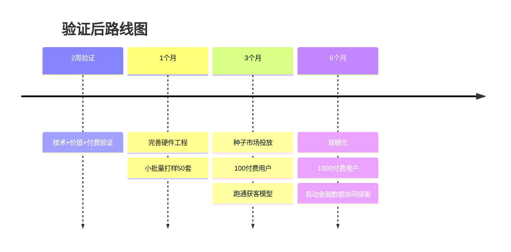

# 🗓️ 2 周轻量验证计划

> 本文档阐述：如果给我 2 周时间，如何用最低成本验证「夜安」的技术可行性、用户价值和付费意愿。

---

## 一、验证目标：我们要证明什么？

在投入大规模开发前，必须用最低成本验证 3 个核心假设：

| 假设 | 验证问题 | 验证方法 |
|------|---------|---------|
| **技术假设** | 床脚传感器能否区分翻身/起床/跌倒？ | Arduino 原型采集真实信号 |
| **AI 假设** | Agent 能否生成有用、准确、像人话的分析？ | 真实数据跑通 4 个 Agent |
| **价值假设** | 子女是否觉得"AI 周报"缓解了焦虑？ | 种子用户测试 + NPS |
| **付费假设** | 子女是否愿意为此付费？ | 真实付费意向测试 |

---

## 二、两周详细计划

### 📅 Week 1：技术验证 + AI 核心验证

#### Day 1-2：搭建硬件原型
- **任务**：用 Arduino + MPU6050 搭建一个最小传感器原型
- **动作**：贴在自己床脚，采集翻身、起床、模拟跌倒（扔重物）的震动数据
- **产出**：3 类动作各 30 组，共 90 组原始信号数据
- **验证指标**：✅ 三类动作的波形特征能否肉眼区分？

#### Day 3-5：搭建 AI Agent 工作流（核心阶段）
- **任务**：用真实/模拟数据跑通 4 个 Agent
- **动作**：
  - 接入 DashScope API
  - 调试 4 个 Agent 的 Prompt
  - 用 Day1-2 的真实数据 + 模拟的 30 天基线，测试 Agent 输出
- **产出**：可运行的 Agent Demo 系统
- **验证指标**：✅ Agent 的分析是否准确、有用、像人话？

#### Day 6-7：边缘逻辑 + 数据闭环
- **任务**：实现"信号 → 结构化事件 → Agent"的完整链路
- **动作**：编写边缘端特征提取逻辑，跑通端到端流程
- **产出**：完整可演示的 Demo
- **验证指标**：✅ 从震动信号到 AI 周报，全链路能否跑通？

---

### 📅 Week 2：用户价值验证 + 付费验证

#### Day 8-10：种子用户测试
- **任务**：邀请 5 位有独居父母的同事/朋友试用
- **动作**：
  - 将 Demo 系统给他们看
  - 展示"AI 周报"和"对话功能"
  - 记录他们的真实反应
- **核心问题**：
  > "如果这是你妈妈的真实数据，这份 AI 周报对你有用吗？"
  > "它是否缓解了你对父母的担心？"
- **验证指标**：✅ 是否击中"想知道却问不出"的痛点？

#### Day 11-12：付费意愿测试
- **任务**：测试真实付费意愿
- **动作**：
  - 制作一个简单 H5 落地页（含产品介绍 + 价格）
  - 设置"9.9 元预约体验"按钮
  - 向种子用户和小范围社群投放
- **核心问题**：
  > "硬件 199 元 + 会员 29.9 元/月，你会买吗？为什么？"
- **验证指标**：✅ 5 人中是否有 ≥3 人明确表示愿意付费？

#### Day 13-14：复盘 + 迭代决策
- **任务**：汇总所有数据，输出验证结论
- **动作**：
  - 整理技术验证结果（信号区分度）
  - 整理 AI 验证结果（Agent 输出质量）
  - 整理用户反馈（NPS、付费意愿）
  - 制作 1 个标杆案例
- **产出**：市场验证报告 + 下一步决策

---

## 三、Go / No-Go 决策标准

### Go 标准（继续推进）
- ✅ 传感器信号区分度 ≥ 85%
- ✅ Agent 输出获得种子用户认可
- ✅ 付费意愿 ≥ 60%（5 人中 ≥3 人）

### No-Go / Pivot 标准
- ❌ 信号无法区分 → 优化传感器位置/数量，或转向床垫方案
- ❌ Agent 无价值 → 优化 Prompt，或换更强模型
- ❌ 无付费意愿 → **Pivot 到纯软件方案**：放弃自研硬件，接入现有智能设备（智能音箱、智能门锁）数据，纯做 AI 陪护 Agent 层

---

## 四、资源投入清单

### 4.1 人力
- **1 人全职**（你本人）：硬件搭建 + 代码编写 + 用户访谈

### 4.2 资金预算（总计 < 1000 元）

| 项目 | 用途 | 预算 |
|------|------|------|
| 硬件 | ESP32 开发板 + MPU6050 + 配件 | 200 元 |
| 大模型 API | DashScope 调用费 | 100 元 |
| 物流 | 寄送原型给志愿者 | 100 元 |
| 志愿者礼品 | 感谢种子用户 | 300 元 |
| H5 落地页 | 用免费工具（金数据/兔展） | 0 元 |
| 机动预算 | 应急 | 300 元 |
| **合计** | | **1000 元** |

### 4.3 工具
- **硬件**：Arduino IDE + Edge Impulse（TinyML，免费版）
- **AI**：DashScope（通义千问 API）
- **前端**：Next.js + Vercel（免费部署）
- **落地页**：金数据/兔展（免费）
- **数据分析**：飞书多维表格（免费）

---

## 五、验证后的下一步规划

---

## 六、风险预案

| 阶段 | 潜在风险 | 预案 |
|------|---------|------|
| 技术验证 | 床脚信号太弱/噪声大 | 改用床垫下传感器，或增加传感器数量 |
| AI 验证 | Agent 输出不稳定 | 增加 few-shot 示例，约束输出格式 |
| 用户验证 | 老人抗拒安装 | 强调"零操作、零感知"，由子女远程管理 |
| 付费验证 | 付费意愿低 | 调整定价，或先用免费基础版积累用户 |

---

## 结语

这个 2 周计划的核心是**用最低成本快速验证最关键的假设**，而不是闭门造车做完美产品。

**最关键的一步**是 Week 1 的 AI 验证——证明"大模型 Agent 真能把冰冷数据变成有温度的陪护"。
如果这一步成立，整个产品的价值主张就站住了。

